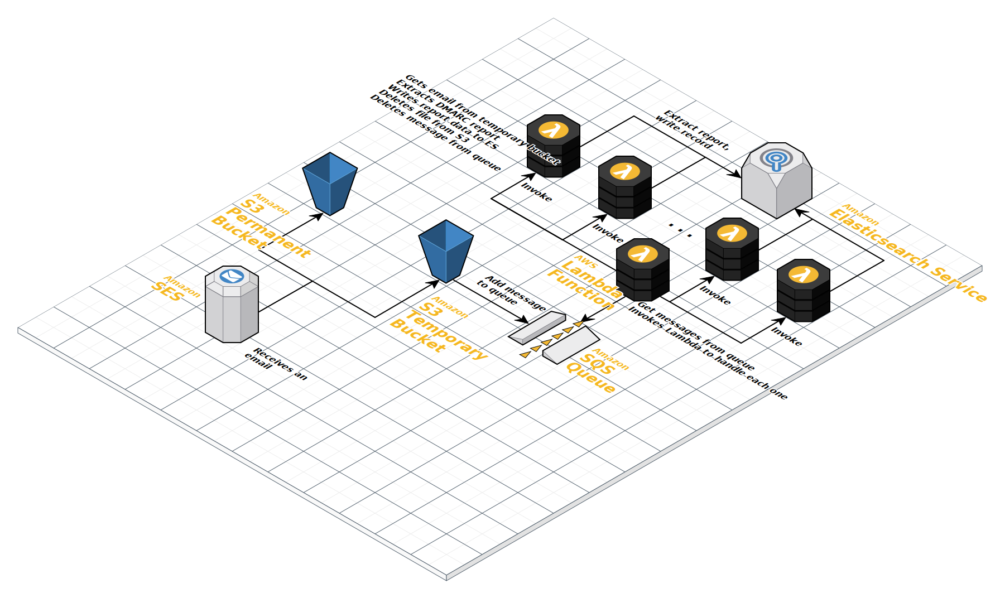

# dmarc-import-terraform :cloud: :zap: #

[](https://travis-ci.org/dhs-ncats/dmarc-import-terraform)

`dmarc-import-terraform` contains the Terraform configuration files
that build the AWS infrastrusture used for parsing DMARC aggregate
reports.  This repository goes along with
[`dmarc-import`](https://github.com/dhs-ncats/dmarc-import), which
contains the actual source code for ingesting, parsing, and saving the
DMARC aggregate reports.

Here is a [Cloudcraft.co](https://cloudcraft.co) diagram of the basic
infrastructure created by these Terraform files:


## Installation of the Terraform infrastructure ##

```bash
terraform init
terraform apply -var-file=production.tfvars
```

The `apply` command forces you to type `yes` at a prompt before
actually deploying any infrastructure, so it is quite safe to use.  If
you want an extra layer of safety you can opt to use this command when
you just want to validate your Terraform syntax:
```bash
terraform validate -var-file=production.tfvars
```

If you want to see what Terraform *would* deploy if you ran the
`apply` command, you can use this command:
```bash
terraform plan -var-file=production.tfvars
```

## License ##

This project is in the worldwide [public domain](LICENSE.md).

This project is in the public domain within the United States, and
copyright and related rights in the work worldwide are waived through
the [CC0 1.0 Universal public domain
dedication](https://creativecommons.org/publicdomain/zero/1.0/).

All contributions to this project will be released under the CC0
dedication. By submitting a pull request, you are agreeing to comply
with this waiver of copyright interest.
